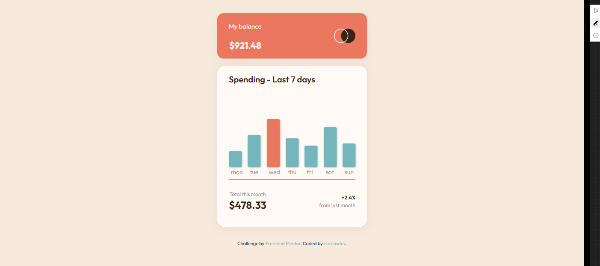
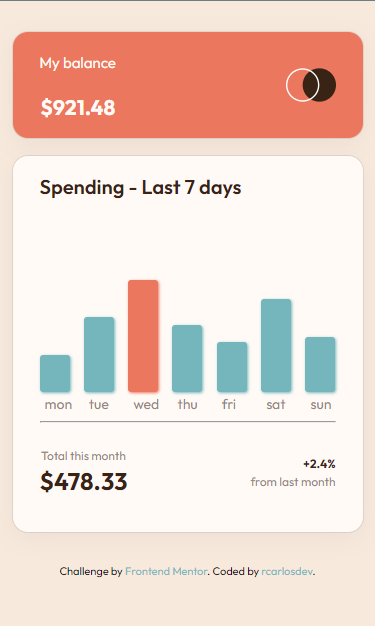

# Chart component - Exercise Frontend Mentor

## Desktop view



## Movil view



## Author

<!-- - Website - [Add your name here](https://www.your-site.com) -->
- Frontend Mentor - [@rcarlosdev](https://www.frontendmentor.io/profile/rcarlosdev)
- Twitter - [@rcarlosdev](https://www.twitter.com/rcarlosdev)

# Building the site

1. Clone the repository
2. Install dependencies

```bash
npm install ó yarn install
```

3. Start a local server to preview the site

```bash
npm run dev ó yarn dev
